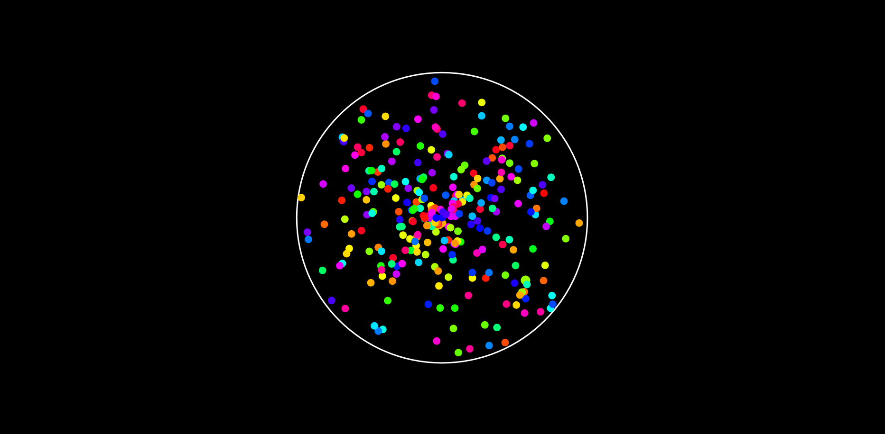

# 🎨 Bouncing Balls in a Circle

A fun little web experiment where colorful balls bounce inside a circle.  
Every time a ball touches the circle’s border, a **new ball** is added!  

 

---

## 🚀 Features
- Black background with a centered circle.
- Colorful balls that bounce around inside.
- Each time a ball hits the circle border, it spawns another ball.
- Uses **HTML5 Canvas** and **JavaScript** (no libraries needed).

---

## 🛠️ Technologies Used
- **HTML5**
- **CSS3**
- **JavaScript (Canvas API)**

---

## 📂 Project Structure
-   .
-   ├── index.html # Main file with canvas and script
-   ├── README.md # Project documentation
-   └── preview.png # Optional screenshot (add your own)
---

## ▶️ How to Run
1. Clone this repository:
   ```bash
   git clone https://github.com/zDR34M/ball-in-circle.git```
2. Open index.html in your browser.
3. Watch the magic happen ✨
